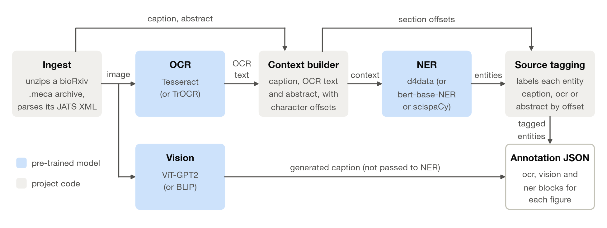
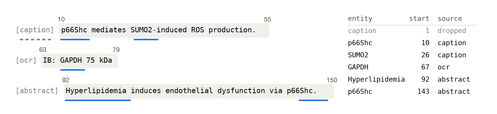
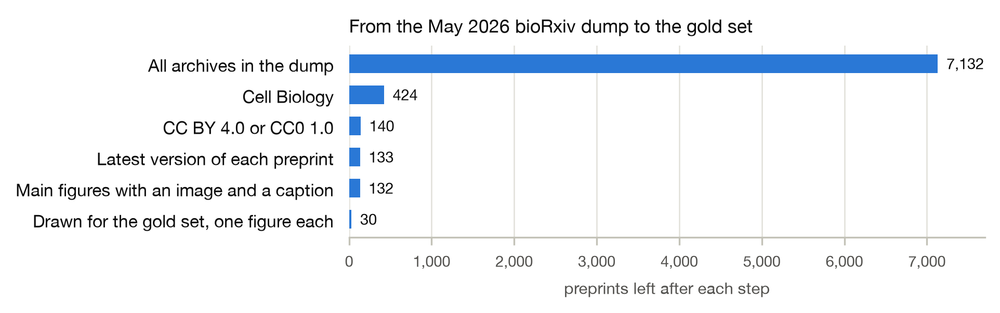
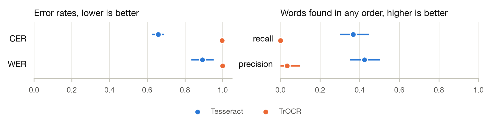
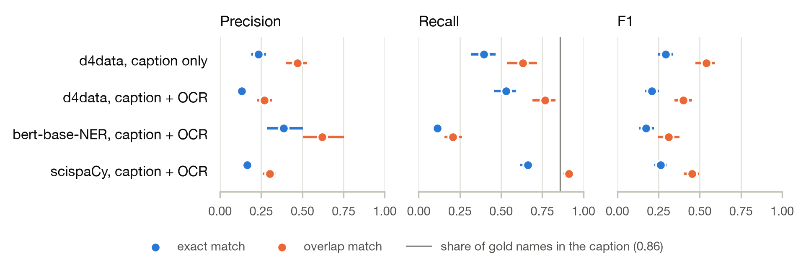
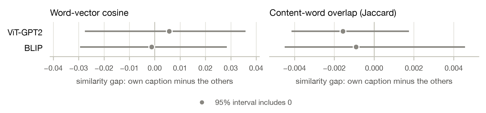

# BFG: annotating the figures of biomedical preprints by orchestrating pre-trained AI models

**CM3070 Final Project, final report**

**Template:** CM3020 Artificial Intelligence, Project Idea 1: Orchestrating AI models to achieve a goal

**Repository:** [TBD repository URL]

**Word count:** WORDCOUNT words in Chapters 1 to 6, excluding references, table and figure legends, and chapter titles

September 2026

---

## Table of contents

1. Introduction
    1.1 Concept and motivation
    1.2 Users and what they need
    1.3 Aims and objectives
    1.4 Structure of the report
2. Literature review
    2.1 Figures as evidence
    2.2 Reading the text inside figures
    2.3 Captioning scientific images
    2.4 Biomedical named entity recognition
    2.5 Orchestrating models
    2.6 Existing systems
    2.7 Summary and design implications
3. Design
    3.1 Domain and users
    3.2 Requirements
    3.3 Architecture
    3.4 Passing the image text to the NER model
    3.5 Choice of models
    3.6 Gold set
    3.7 Evaluation design
4. Implementation
    4.1 Tools and layout
    4.2 Reading MECA archives
    4.3 A common interface for every model
    4.4 The context builder
    4.5 Cleaning the NER output
    4.6 Building the gold set
    4.7 The evaluation notebook
    4.8 Worked example
    4.9 Testing and speed
5. Evaluation
    5.1 The gold set
    5.2 RQ1: reading the image text
    5.3 RQ2: does the image text help NER?
    5.4 RQ3: comparing the NER models
    5.5 RQ4: do general captioners describe the figures?
    5.6 Speed
    5.7 Critical discussion
    5.8 Limitations
    5.9 Extensions
6. Conclusion
    6.1 Summary
    6.2 Main lessons
    6.3 Future work
    6.4 Reflection

References

## List of figures

- Figure 3.1: Architecture of the BFG pipeline
- Figure 3.2: How the context builder assembles the NER input
- Figure 4.1: From the May 2026 bioRxiv dump to the 30 gold figures
- Figure 4.2: Figure 6 of preprint 577109, the development example
- Figure 5.1: OCR scores of Tesseract and TrOCR
- Figure 5.2: Precision, recall and F1 of the NER runs
- Figure 5.3: Paired differences for RQ2 and RQ3
- Figure 5.4: Similarity gap between generated and paper captions

## List of tables

- Table 2.1: Existing systems that process scientific figures or biomedical text
- Table 3.1: Candidate models for each stage
- Table 3.2: Research questions and metrics
- Table 4.1: Pipeline output for the eight figures of preprint 577109
- Table 4.2: Median time per figure for each stage
- Table 5.1: OCR accuracy against the gold image text (RQ1)
- Table 5.2: d4data with and without the OCR text (RQ2)
- Table 5.3: The three NER models on the caption with the OCR text (RQ3)
- Table 5.4: Generated captions against the paper captions (RQ4)
- Table 5.5: Gold entity types and the labels of the two typed models

## List of listings

- Listing 4.1: Reading each figure's caption and image link from the JATS XML
- Listing 4.2: The stage interface and one registry factory
- Listing 4.3: Joining the caption, the OCR text and the abstract
- Listing 4.4: Widening entities to whole words
- Listing 4.5: The checks run before a gold figure can be marked done
- Listing 4.6: The shared bootstrap and the whole word match

---

## 1. Introduction

### 1.1 Concept and motivation

This project follows the template **CM3020 Artificial Intelligence, Project Idea 1: Orchestrating AI models to achieve a goal**. The goal I chose is to annotate the figures of biomedical preprints. For every figure in a preprint, the system, called BFG (BiologicalFiGures), produces a structured record of the biomedical names the figure shows, such as genes, proteins, chemicals and cell lines, and says for each name whether it came from the caption, from the text printed inside the image, or from the abstract. No single pre-trained model does this. It needs a model that reads text in images (optical character recognition, OCR), a model that describes images (a vision language captioner) and a model that finds names in text (named entity recognition, NER). The work of the project is in connecting them and in testing whether the connection helps.

Figures matter because much of the evidence of a biomedical paper is in them. A western blot names the antibodies it was probed with, a micrograph names its stains and markers, and a plot names the genes on its axes. Text mining tools read the abstract and the body text, so text that exists only in the image is out of their reach. Figures are also numerous. The May 2026 bioRxiv dump used in this project holds 7,132 preprints with 54,418 figures, about 7.6 per preprint, and its Cell Biology collection has 424 preprints with 3,463 figures, about 8.2 per preprint (Section 4.6). How much is lost can be measured on the gold set built for this project. Of its 457 hand annotated names, 65 (14%) appear only in the image and nowhere in the caption (Chapter 5).

### 1.2 Users and what they need

The intended users are biocurators, the people who read papers and record their findings in biological databases. Curation is a sequence of steps. The curator first triages the literature to find the papers worth reading, then records the entities in each paper and the evidence for them. Wei, Kao and Lu (2013) built PubTator to support exactly these steps and describe manual curation as expensive and slow, which is why tool support is worth building. Gibson et al. (2016) describe how the European Nucleotide Archive moved its functional annotation away from mainly manual curation, which cost a lot of curator time, towards automated checks. Balderas-Martínez et al. (2017) report a case study in which text mining support improved the curation of microRNAs linked to idiopathic pulmonary fibrosis. None of these tools reads the text inside figures.

From this, the output a curator needs is not a fluent description of a figure but a list of names for each figure that can be checked quickly. Each name should point back to where it was found, so that a curator can see whether it came from the caption, which they could have searched anyway, or from the image, which they could not. A wrong name that can be traced is cheap to reject, while a fluent but wrong sentence is not (Ji et al., 2023). This shaped the design in Chapter 3, where every entity carries its source and its character offsets.

### 1.3 Aims and objectives

The aim is to build a pipeline that orchestrates pre-trained models of three kinds, OCR, image captioning and NER, to annotate the figures of biomedical preprints, and to measure honestly what each model and the orchestration itself contribute. Five objectives follow from it. The first is to read bioRxiv MECA archives and pair each figure image with its caption. The second is to wrap every model behind one interface, with at least two candidates for each stage, so that models can be compared, chosen and rejected on evidence. The third is to pass the OCR output into the NER input while keeping track of where each part came from. The fourth is to build a gold set of 30 openly licensed figures annotated by hand, since no benchmark exists for the text inside biomedical figures. The fifth is to use the gold set to answer four research questions, on OCR accuracy, on the value of the image text for NER, on the choice of NER model and on the usefulness of general captioners, and to report the speed of each stage.

### 1.4 Structure of the report

Chapter 2 reviews the work on figures, OCR, captioning, biomedical NER and model orchestration, and compares the existing systems. Chapter 3 presents the design, the model choices, the gold set and the evaluation plan. Chapter 4 describes the implementation with its most important code and a worked example. Chapter 5 reports and critiques the results, and Chapter 6 concludes.

---

## 2. Literature review

### 2.1 Figures as evidence

Large collections of scientific figures now exist, but they are built around captions rather than the text inside the images. BIOMEDICA (Lozano et al., 2025) gathers over 24 million image and caption pairs from over 6 million open access articles and trains vision language models on them. Its unit is the pair of an image and its caption, which suits a model that matches pictures to descriptions, but it records neither the text printed in the image nor the entities a curator would want.

SciCap (Hsu, Giles and Huang, 2021) is the clearest test of whether figures can be described automatically. It collects over two million figures from over 290,000 computer science papers published on arXiv between 2010 and 2020 and trains models to generate their captions. The best models reached a BLEU-4 score of about 0.02, and the authors conclude that intensive research will be needed before scientific figures can be captioned reliably. They also tried the text found in the figures, such as titles, legends and axis labels, as input. Models using only this text did about as well as models using only the image, and combining the two did slightly worse. Their suggested next step was to use information from the full text of the paper.

Two lessons follow for this project. Captioning a scientific figure is hard even in the narrow domain of computer science charts, so a general captioner should not be expected to describe a blot or a micrograph. And the text inside a figure carries as much signal as its pixels, which makes OCR a more promising route to the content of a figure than captioning. SciCap is, however, limited to charts, while biomedical figures mix micrographs, gels, diagrams and plots, often within one figure, so its results can only be a guide.

### 2.2 Reading the text inside figures

Tesseract (Smith, 2007) is the standard open source OCR engine. It was designed for printed pages, where text runs in lines and blocks, and its layout analysis looks for such lines before recognising them. The version used here, 5.5, recognises each line with an LSTM network. Figure text breaks the page assumptions. It is short, scattered, sometimes rotated, often printed over an image, and full of symbols and Greek letters, so Tesseract should find it much harder than a page of prose.

TrOCR (Li, M. et al., 2023) replaces the classic pipeline with a transformer encoder and decoder, both pre-trained, and reports strong results on printed and handwritten text. It is, however, a recogniser of single text lines. Its input is the image of one line, and finding the lines on a page is left to a separate detection model. This matters because a figure is not a line, and Chapter 5 shows what happens when TrOCR is given a whole figure.

No benchmark exists for this task. The ICDAR 2021 competition on scientific literature parsing (Jimeno Yepes, Zhong and Burdick, 2021) set tasks on the layout of document pages and on the structure of tables, but none on the text inside figures. Without a benchmark, the OCR candidates could only be compared on text transcribed by hand, which is one of the reasons the project built its own gold set.

### 2.3 Captioning scientific images

Modern captioners combine an image encoder with a text decoder, both built on the transformer (Vaswani et al., 2017). The ViT-GPT2 captioner used as the baseline joins a Vision Transformer encoder (Dosovitskiy et al., 2021) to a GPT-2 decoder (Radford et al., 2019). BLIP (Li, J. et al., 2022) trains one model for both understanding and generation and cleans its noisy web training data by generating synthetic captions and filtering out the poor ones. Both are general domain models. LLaVA (Liu et al., 2023) goes further by connecting an image encoder to a large language model and tuning it on visual instructions, so that it can answer questions about an image rather than only caption it.

Biomedical versions of these ideas exist, but none fitted this project. BiomedCLIP (Zhang, S. et al., 2023) is trained on fifteen million figure and caption pairs from PubMed Central, but it is a contrastive model. It scores how well an image matches a given text and cannot generate one. BioViL-T (Bannur et al., 2023) is also built from two encoders and is trained on chest X-rays and their radiology reports, a narrow clinical domain far from cell biology. LLaVA-Med (Li, C. et al., 2023) adapts LLaVA to biomedicine with figure and caption data from PubMed Central and is the closest to what the project needed, but its weights are released as differences against a separate Llama base model, and at seven billion parameters it is far heavier than the other stages. The practical choice was therefore between general captioners that run on a laptop and a domain model that could not be deployed in the time available.

The risk with any generator is hallucination, text that is fluent but not supported by the input (Ji et al., 2023). For a curator this is worse than no output, because a confident sentence about the wrong content takes effort to reject. This framed the vision stage as a measurement of the domain gap rather than a feature to rely on.

### 2.4 Biomedical named entity recognition

Most current NER models fine-tune a pre-trained BERT encoder (Devlin et al., 2019) to label each token. BioBERT (Lee et al., 2020) continued the pre-training of BERT on PubMed abstracts (4.5 billion words) and PubMed Central full texts (13.5 billion words) and improved on BERT in biomedical NER. DistilBERT (Sanh et al., 2019) compresses BERT into a model 40% smaller and 60% faster that keeps 97% of its language understanding. The d4data biomedical-ner-all model used as the default here is a DistilBERT fine-tuned on MACCROBAT, a corpus of clinical case reports annotated with a detailed typing system (Caufield et al., 2019). The control, bert-base-NER, is BERT fine-tuned on the CoNLL-2003 news corpus (Tjong Kim Sang and De Meulder, 2003) and knows only people, organisations, locations and a miscellaneous type. The two differ in their fine-tuning data rather than their pre-training, so comparing them shows how much the labelled data matters. scispaCy (Neumann et al., 2019) takes a different route, with fast spaCy pipelines trained on biomedical text. Its en_core_sci_lg model finds entity spans without typing them.

Two problems stand out for figures. The first is schema mismatch. The labels a model knows come from its training corpus, and none of these corpora matches cell biology. MACCROBAT describes patients, with types such as diagnostic procedure and sign or symptom, and has no type for genes or cell lines. Closer resources exist. BioRED (Luo et al., 2022) annotates genes, chemicals, diseases, variants, species and cell lines, and PubTator Central (Wei et al., 2019) applies such types to full text articles at scale, but only to the text of the article. The second problem is the form of figure text. NER models are trained on sentences, while OCR output is a list of fragments, such as lone gene symbols, tick labels, units and panel letters, often with recognition errors. There is no reason to expect a sentence model to behave well on it, and measuring how it does behave is part of the evaluation.

### 2.5 Orchestrating models

Chaining specialised components towards a scientific goal has a long history. The Robot Scientist Adam (King et al., 2009) linked hypothesis generation, experiment planning, robotic experiments and analysis to discover gene functions in yeast with little human input. In literature curation, LiSA (Martenot et al., 2022) chains deep learning models into an assisted search pipeline that finds reports of serious adverse drug events for human reviewers. More recently, Mondal et al. (2025) use several large language model agents to curate metadata at scale, which reflects a move from fixed pipelines of small models to flexible agents.

The trade off between these styles shaped this project. A pipeline of separate models lets each stage be tested, replaced and measured on its own, but errors propagate, since an OCR mistake becomes part of the NER input. An end to end model avoids that seam but is heavier and harder to inspect, and a language model asked to tag entities may return labels outside any fixed schema. BFG uses a pipeline and makes the seam visible by recording which source each entity came from, so that the effect of the image text, including its errors, can be measured rather than hidden.

### 2.6 Existing systems

Table 2.1 compares the systems closest to this project.

**Table 2.1: Existing systems that process scientific figures or biomedical text**

| System | Input | What it extracts | Named entities | Text inside figures |
| --- | --- | --- | --- | --- |
| GROBID (Lopez, 2009) | PDF | bibliographic metadata and document structure | no | no |
| DeepFigures (Siegel et al., 2018) | PDF | figure and table regions with their captions | no | no |
| Auto-CORPus (Beck et al., 2022) | HTML full text | text in BioC format, tables, abbreviations | no | no |
| PubTator Central (Wei et al., 2019) | abstracts and full texts | genes, chemicals, diseases, species, variants, cell lines | yes | no |
| EXSCLAIM! (Schwenker et al., 2023) | figures and captions | subfigures paired with their part of the caption | no | no |
| BIOMEDICA (Lozano et al., 2025) | open access articles | image and caption pairs for model training | no | no |
| BFG (this project) | MECA archive | image text, generated caption, entities with their source | yes | yes |

The systems fall into two groups. GROBID, DeepFigures and Auto-CORPus turn documents into structure, and only DeepFigures finds figures at all. It solves a problem that the MECA format of bioRxiv already solves, since each figure is delivered as a separate image with its caption in the JATS XML. PubTator Central finds exactly the kind of entities a curator wants, but only in the text of the article. EXSCLAIM! and BIOMEDICA work on figures, but EXSCLAIM! separates compound figures into labelled subfigures and pairs each with its part of the caption, for materials science microscopy, and BIOMEDICA builds training data from captions. Among the systems reviewed here, none reads the text inside biomedical figures and links it to named entities, which is the gap BFG addresses. The claim is limited to the systems in Table 2.1 and is not a proof that no such system exists.

### 2.7 Summary and design implications

The review led to five design decisions. Figures are taken from the JATS XML of MECA archives rather than extracted from PDFs. OCR is a stage of its own, with Tesseract and TrOCR as candidates, because no benchmark says which suits figure text. General captioners are measured against the real captions, since the domain models either cannot generate text or were too heavy to deploy. Three NER models with different training data are compared on untyped names, because none of their schemas fits cell biology. Finally, the pipeline records the source of every entity, so that the contribution of the image text can be measured on a gold set built for the purpose.

---

## 3. Design

### 3.1 Domain and users

The domain is cell biology preprints on bioRxiv. Cell biology figures are dense with printed text, such as antibody names on blots, stains and markers on micrographs, and gene names on plots, and the Cell Biology collection has more figures per preprint than the dump as a whole (8.2 against 7.6). Restricting the project to one subject also keeps the entity types manageable. The users are the biocurators described in Section 1.2. They need a list of names for each figure that they can check against the figure itself, so traceability matters more than fluent text.

### 3.2 Requirements

The functional requirements follow from the objectives. The system must read a MECA archive, find every figure with its caption, and run OCR, captioning and NER on each figure. The NER input must include the OCR text, and every entity in the output must record its source and its position. The output is one JSON file per article. It must be possible to change the model used by any stage by its name, without changing the pipeline, and a missing or failing model must leave a clear status in the output rather than stop the run.

The non-functional requirements came from the setting. The pipeline has to run on a laptop without a dedicated GPU, since that is the hardware a curator or a student is likely to have. Model weights are read from a local folder and nothing is downloaded at run time, which keeps runs reproducible and lets the pipeline work behind restrictive networks. Results must be reproducible, with fixed seeds and saved model outputs. Every figure in the gold set must come from a preprint released under CC BY 4.0 or CC0 1.0, because the repository that holds the images is public. Finally, the code must be covered by unit tests.

### 3.3 Architecture

Figure 3.1 shows the architecture. The ingest step unpacks a MECA archive, parses the JATS XML and pairs each figure with its image. For each figure, the OCR and vision stages read the image independently. The context builder then joins the caption, the OCR text and the abstract into one input for the NER stage, and the entities it returns are tagged with their source before the record of the figure is written.



One decision in this diagram needs a justification. The generated caption is recorded in the output but not passed to the NER stage. In the prototype, the ViT-GPT2 captions had a mean Jaccard overlap of 0.000 with the real captions and described biomedical figures as collections of household objects. Feeding such text to the NER model could only add wrong names. Keeping the vision stage in the pipeline, but outside the NER input, keeps the domain gap measurable (RQ4) without letting it damage the entity list, and a domain aware captioner could later be connected in the same place.

### 3.4 Passing the image text to the NER model

The orchestration lives in the context builder (Figure 3.2). It joins the three sources into one string, each after a short header such as [ocr], and records where each part starts and ends. Every entity returned by the NER model carries character offsets into this string, so the part it falls in gives its source. This is what makes the contribution of the image text measurable. An entity tagged ocr was found in text that no text mining tool would have seen.



The order of the parts is a decision that came out of testing (Section 4.4). The NER models read at most 512 tokens at a time. The abstract is the same for every figure of an article and was first placed at the start, where it filled the window. The final order puts the text about the figure first, the caption and then the OCR text, with the shared abstract last. Longer inputs are split into overlapping windows, so nothing is cut off.

### 3.5 Choice of models

The template asks for models chosen on evidence, with some tested and rejected. Table 3.1 lists the candidates for each stage and the reason each was included.

**Table 3.1: Candidate models for each stage**

| Stage | Model | Why it was included | Role |
| --- | --- | --- | --- |
| OCR | Tesseract 5.5 | mature page OCR that runs on a CPU | default |
| OCR | TrOCR base printed | transformer recogniser for printed text | candidate, rejected in Chapter 5 |
| Vision | ViT-GPT2 captioner | small general captioner, the prototype baseline | default |
| Vision | BLIP base captioner | general captioner trained separately, with a different method | second captioner |
| NER | d4data biomedical-ner-all | DistilBERT fine-tuned on clinical case reports, fast, typed labels | default |
| NER | bert-base-NER | BERT fine-tuned on news, a general domain control | control |
| NER | scispaCy en_core_sci_lg | biomedical vocabulary, untyped spans | comparison |

Four more models were considered and rejected. BiomedCLIP cannot generate text, and BioViL-T is a radiology model built from two encoders, so neither can fill a captioning stage. LLaVA-Med needed a separate base model and far more memory than a laptop stage allows. A general language model served locally through Ollama was tried as the NER stage early in development, but it labelled bioinformatics tools such as BLAST, NanoFilt and CD-HIT as genes or proteins and returned labels outside the requested schema. A token classifier with a fixed label set was more predictable, so the language model was dropped.

Having two candidates per stage serves a purpose beyond the template. With one model per stage, a poor result cannot show whether the stage or the model is at fault. BLIP tests whether the domain gap belongs to ViT-GPT2 alone or to general captioners, and bert-base-NER tests whether the clinical labels of d4data help at all compared with a model that knows nothing about biology.

### 3.6 Gold set

No existing dataset has the text inside biomedical figures transcribed and its entities marked, so the evaluation depends on a gold set built for this project. It holds 30 figures drawn from the May 2026 bioRxiv dump. The pool is the Cell Biology preprints released under CC BY 4.0 or CC0 1.0, in their latest version, with at least one main figure that has both an image and a caption. Thirty preprints were drawn from this pool with a fixed seed, and one figure was drawn from each. Taking one figure per preprint stops a few papers, with their own style and vocabulary, from dominating the scores. The licence filter is what allows the images to be published in the repository.

Each figure is annotated with four things. The figure type is one of plot, micrograph, blot or gel, diagram, mixed and other. The image text is a transcription of all the legible printed text in the image, in a fixed reading order, and is the reference for OCR. The entities are the specific biomedical names that appear in the caption or the image text, each with one of seven types (gene or protein, chemical, disease, organism, cell or tissue, technique, other), and are the reference for NER. Free notes record anything unusual. The types follow corpora such as BioRED (Luo et al., 2022), with technique added because methods are a large part of what cell biology figures name.

The rules are written down in annotation guidelines that are part of the repository. The most important are that each figure is annotated before looking at any model output for it, so the reference is not pulled towards the models, that names are copied exactly as printed, and that a name found only in the article, and not in the figure or its caption, is left out. Typing out a dense figure takes a long time, so the guidelines allow text to be copied with an OCR tool that is not one of the models being evaluated, such as Live Text on macOS, provided every line is then checked against the image and the notes say so.

The set was annotated by one person, the author. With a second annotator, agreement could be measured with Cohen's kappa (Cohen, 1960) or, since NER has no fixed set of negative cases, with the pairwise F-measure recommended by Hripcsak and Rothschild (2005). Time did not allow this, and it is the main limitation of the set (Section 5.8). The size of 30 figures is also set by annotation time. Instead of hiding the uncertainty that comes with a small set, every score is reported with a bootstrap interval.

### 3.7 Evaluation design

The evaluation asks four research questions, set out with their metrics in Table 3.2. Speed is reported for every stage as the median time per figure.

**Table 3.2: Research questions and metrics**

| Question | Compared | Metrics |
| --- | --- | --- |
| RQ1: How accurately does each OCR model read the text inside the figures? | Tesseract, TrOCR | CER, WER, word recall and precision |
| RQ2: Does adding the OCR text to the caption help the NER model find the gold entities? | d4data on the caption alone and on the caption with the OCR text | precision, recall, F1, paired differences |
| RQ3: Which NER model finds the gold entities best? | d4data, bert-base-NER and scispaCy on the caption with the OCR text | precision, recall, F1, paired differences |
| RQ4: Do general captioners say anything specific about their figure? | ViT-GPT2, BLIP | similarity to the paper caption against a shuffled baseline |

For OCR, the character and word error rates (CER and WER) are pooled over the figures, as total edits divided by the total length of the gold text, so a figure with more text counts for more. Both depend on the reading order, which is partly a judgement call in a busy figure, so word recall and precision, which ignore the order, are reported alongside them.

For NER, entities are matched on their text, ignoring case, and not on their type, because the label sets of the models do not match the gold types (Section 2.4). Scores are micro averaged, pooling the counts over all figures. The gold figures have very different numbers of names, and one has none, for which recall is undefined, so a macro average would be unstable. Two matching rules are reported. The exact rule requires the same string. The overlap rule also accepts a match when one string contains the other as whole words, so HeLa cells matches HeLa, which shows how much of the error concerns boundaries rather than missing names.

Every interval is a 95% percentile interval from 2,000 bootstrap resamples (Efron and Tibshirani, 1993). Figures are resampled rather than entities, because the names within one figure are not independent. A comparison between two systems uses the same resamples for both, so the interval of the difference accounts for their being scored on the same figures.

For the captioners, the standard caption metrics did not fit. CIDEr (Vedantam, Zitnick and Parikh, 2015) is designed around several reference captions per image, while each figure has one. BERTScore (Zhang, T. et al., 2020) and Sentence-BERT (Reimers and Gurevych, 2019) need further models that were not available offline. The design uses what was already installed, the biomedical word vectors of en_core_sci_lg, and compares each generated caption with the caption of its own figure through the Jaccard overlap of their content words and the cosine similarity of their mean word vectors. On its own a similarity means little, so it is compared with the mean similarity of the same generated caption to the other 29 captions. If a generated caption says anything specific about its figure, it should be closer to its own caption than to the others.

---

## 4. Implementation

### 4.1 Tools and layout

BFG is a Python 3.13 package managed with uv, whose lock file fixes every dependency. The code is split into ingest, stages, pipeline and a command line interface, with the tests in a separate folder and six notebooks for getting the data, drawing the gold set, annotating it, evaluating, a demonstration, and running everything in order. Two version pins came out of development. Python 3.14 was dropped for 3.13 because scispaCy 0.6.2 and its en_core_sci_lg 0.5.4 model would not install on it, and transformers is held below version 5, which removed the slow tokenizer that the TrOCR processor needs. The en_core_sci_lg model also pins older libraries than current spaCy needs, so a small script installs it without its declared dependencies and patches one setting in its configuration.

### 4.2 Reading MECA archives

A bioRxiv MECA archive is a ZIP file that holds the JATS XML of the article and its figure images. The ingest step unpacks it once, reusing earlier extractions, finds the JATS file and parses it. JATS files from different years use different XML namespaces, so the parser matches elements by their local name (Listing 4.1).

```python
for fig in _iter_local(root, "fig"):
    fig_id = fig.attrib.get("id", "").strip()
    label = _text_of(_first_local(fig, "label"))
    caption = _text_of(_first_local(fig, "caption"))
    href = None
    graphic = _first_local(fig, "graphic")
    if graphic is not None:
        for k, v in graphic.attrib.items():
            if _localname(k) == "href":
                href = v
                break
```

*Listing 4.1: Reading each figure's caption and image link from the JATS XML, matching elements by local name.*

The image link is then matched against the files in the archive, first by file name and then by the name without its extension. The sampling notebook uses the same parser, so the caption stored with a gold figure is exactly the one the pipeline reads.

### 4.3 A common interface for every model

Every model sits behind one abstract class, ModelStage, with two methods (Listing 4.2). is_available reports whether the dependencies of the model are installed, and run takes a payload and returns a StageResult with a status of ok, unavailable or error. run must never raise, so a failing model leaves a readable status in the output while the other stages carry on. The registry maps a key to a factory for each backend, and each factory imports its libraries only when it is called, so a machine without spaCy can still run everything else.

```python
class ModelStage(ABC):
    name: str = "stage"
    backend: str = "unknown"

    @abstractmethod
    def is_available(self) -> tuple[bool, str | None]:
        """Return (available, reason). Reason is only set when False."""

    @abstractmethod
    def run(self, payload: Mapping[str, Any]) -> StageResult:
        """Run the stage. Must never raise. Return an error result on any exception."""


def _build_d4data_ner(cfg: Config) -> ModelStage:
    from bfg.stages.ner_hf import HFBiomedicalNERStage

    return HFBiomedicalNERStage(cfg, model_id="d4data/biomedical-ner-all")
```

*Listing 4.2: The stage interface and one registry factory.*

Changing a model is therefore a configuration change. The seven backends of Table 3.1 are registered under keys such as tesseract, blip and scispacy, and the command line takes a key for each stage. The two Hugging Face NER models share one class and differ only in the model name, which made adding bert-base-NER as a control a two line change.

### 4.4 The context builder

The context builder (Listing 4.3) is where the OCR output reaches the NER model. It returns the joined text together with the span of each part.

```python
parts = [("caption", caption or ""), ("ocr", ocr_text or ""), ("abstract", abstract or "")]
for source, raw in parts:
    text = raw.strip()
    if not text:
        continue
    header = f"[{source}] "
    chunk = header + text
    if chunks:
        chunk = "\n\n" + chunk
    content_offset = cursor + len(chunk) - len(text)
    chunks.append(chunk)
    spans.append(ContextSpan(source=source, start=content_offset, end=content_offset + len(text)))
    cursor += len(chunk)
```

*Listing 4.3: Joining the caption, the OCR text and the abstract while recording where each part lies.*

After NER, each entity is given the source of the span its start offset falls in. The first version of the builder put the abstract first. On the eight figures of preprint 577109, the development article, the abstract filled the 512 token window and the pipeline returned no entities at all from the OCR text. Putting the caption and the OCR text first, and splitting long inputs into windows that overlap by 128 tokens, raised this to 508 OCR entities over the same figures (Table 4.1). A second problem appeared with scispaCy, which tagged the header word caption as an entity in every figure. Entities whose offsets fall inside a header are now dropped.

### 4.5 Cleaning the NER output

The prototype leaked word pieces such as ##sh and ##oblot into its entity lists, because the Hugging Face aggregation merges most WordPiece fragments but not those the model labels differently from their neighbours. The d4data model is also uncased, so the words it returns are in lower case even where the text says SUMO2. The fix is to trust the character offsets rather than the returned words (Listing 4.4). Every entity is widened to the whole word it touches and its text is cut from the original input, and when two entities end up on the same span, the one with the higher score is kept.

```python
def _snap_to_words(text, entities):
    by_span = {}
    for e in entities:
        start, end = e["start"], e["end"]
        while start > 0 and text[start - 1].isalnum():
            start -= 1
        while end < len(text) and text[end].isalnum():
            end += 1
        if not text[start:end].strip():
            continue
        e = {**e, "word": text[start:end], "start": start, "end": end}
        kept = by_span.get((start, end))
        if kept is None or e["score"] > kept["score"]:
            by_span[(start, end)] = e
    return [by_span[span] for span in sorted(by_span)]
```

*Listing 4.4: Widening entities to whole words using their character offsets.*

Tokenizers that give no offsets fall back to merging the ## pieces directly. The overlapping windows need the maximum input length of the tokenizer, and some tokenizers report a huge placeholder value, so it is clamped to the real limit of the model when the model is loaded.

### 4.6 Building the gold set

The sampling notebook scans all 7,132 archives in under a minute, reading only the manifest and the XML of each ZIP. Figure 4.1 shows how the filters narrow the dump down to the pool of 779 figures from 132 preprints. The notebook records a SHA-1 fingerprint of the archive names and the seed, 20260928, so the same 30 figures are drawn again from the same dump. Each drawn TIFF is saved as a PNG without scaling, and an attribution file credits the authors and licence of every figure. Of the 30 figures, 28 come from preprints under CC BY 4.0 and two under CC0 1.0.



The annotation notebook shows one figure at a time next to a form with the caption, a link to the article, a menu of figure types and boxes for the image text, the entities and the notes. It shows no model output, which enforces the rule of blind annotation. Every save runs the checks in Listing 4.5, and a figure can be marked done only when none of them fails.

```python
source = norm(annotation['paper']['caption'] + ' ' + gold['ocr_text'])
seen = set()
for e in gold['entities']:
    text = norm(e['text'])
    if not text:
        found.append(f"an entity of type '{e['type']}' has no text")
        continue
    if not e['type']:
        found.append(f"{e['text']}: no type given")
    elif e['type'] not in ENTITY_TYPES:
        found.append(f"{e['text']}: '{e['type']}' is not one of the entity types")
    if text not in source:
        found.append(f"{e['text']}: not found in the caption or the image text")
    if text in seen:
        found.append(f"{e['text']}: listed twice")
    seen.add(text)
```

*Listing 4.5: The checks run before a gold figure can be marked done.*

### 4.7 The evaluation notebook

The evaluation notebook runs every backend on the 30 gold figures and saves each output the first time it is computed, so a rerun after an annotation changes takes seconds and needs no model weights. A saved NER output is reused only if its input text is unchanged. The NER input is built with the context builder of the pipeline, without the abstract, because the gold names come from the figure and its caption alone. Listing 4.6 shows the two helpers the scoring depends on.

```python
def boot_ci(stat, n):
    # 95% percentile interval of stat(idx) over N_BOOT resamples of n figures, the same resamples on every call
    idx = np.random.default_rng(SEED).integers(0, n, size=(N_BOOT, n))
    return tuple(np.percentile([stat(i) for i in idx], [2.5, 97.5]))


def mentions(text, name):
    # name occurs in text, ignoring case, and not as part of a longer word
    return re.search('(?<![0-9a-z])' + re.escape(name) + '(?![0-9a-z])', norm_text(text)) is not None
```

*Listing 4.6: The shared bootstrap and the whole word match used by the overlap rule.*

Because boot_ci draws the same resamples on every call, the difference between two systems can be bootstrapped directly as a statistic, which gives the paired intervals of Chapter 5. The pooled CER and WER are also checked against the corpus scores of the jiwer library, and the notebook stops if they disagree.

### 4.8 Worked example

Table 4.1 shows the output of the pipeline for the eight figures of preprint 577109 with the default backends, Tesseract, ViT-GPT2 and d4data.

**Table 4.1: Pipeline output for the eight figures of preprint 577109**

| Figure | OCR characters | Entities | From caption | From OCR | From abstract | ViT-GPT2 caption |
| --- | ---: | ---: | ---: | ---: | ---: | --- |
| 1 | 531 | 105 | 14 | 50 | 41 | a series of photos showing different types of objects |
| 2 | 667 | 71 | 20 | 27 | 24 | a series of photographs showing a variety of different types of objects |
| 3 | 1,126 | 147 | 24 | 101 | 22 | a collage of photos of various appliances |
| 4 | 838 | 105 | 17 | 61 | 27 | a series of photos showing a variety of different types of refrigerators |
| 5 | 708 | 103 | 17 | 59 | 27 | a collage of photos showing different types of objects |
| 6 | 1,086 | 189 | 46 | 113 | 30 | a series of photos showing different types of objects |
| 7 | 487 | 132 | 40 | 63 | 29 | a series of images showing different types of electronic equipment |
| 8 | 523 | 84 | 19 | 34 | 31 | a series of photos showing a series of different colored objects |

Of the 936 entities, 508 came from the OCR text, 197 from the captions and 231 from the abstract, against 19 to 40 entities per figure in the prototype. More entities are not better in themselves, and Chapter 5 measures how many are correct. The table also shows two problems early. Every generated caption describes everyday objects, and the labels come from the clinical schema. On Figure 6 (Figure 4.2), the mutant p66ShcK81R and the enzyme ApaI are labelled as diagnostic procedures, point mutation as a sign or symptom, and SUMO2 as a detailed description. The strings are useful but the labels are not, which is why the evaluation scores names without their types.


### 4.9 Testing and speed

The package has 38 tests. Thirty-one unit tests cover the JATS parser, the MECA extraction, the context builder and source tagging, the merging and snapping of word pieces, and the registry, using small fake stages so that they run in seconds. Seven smoke tests, one for each registered backend, check the stage contract. They run each real model on a tiny image or sentence and assert that the result is a StageResult with a valid status and that nothing is raised, whether or not the model is installed. A last notebook runs the others in order, to check the whole chain from data to results.

Table 4.2 gives the median time per figure of each stage, measured by the evaluation notebook on the CPU of an Apple silicon laptop. The median is used because the first figure also pays for loading the model.

**Table 4.2: Median time per figure for each stage**

| Stage | Backend | Median seconds per figure |
| --- | --- | ---: |
| OCR | Tesseract | 0.81 |
| OCR | TrOCR | 0.39 |
| Vision | ViT-GPT2 | 0.44 |
| Vision | BLIP | 0.55 |
| NER, caption only / caption with OCR | d4data | 0.03 / 0.05 |
| NER, caption only / caption with OCR | bert-base-NER | 0.04 / 0.08 |
| NER, caption only / caption with OCR | scispaCy | 0.06 / 0.08 |

With the default backends a figure takes about 1.3 seconds, so a preprint of eight figures is annotated in about ten seconds. The preliminary report measured 35 to 40 seconds per figure for the prototype. The two numbers come from different versions of the code and are not a controlled comparison, but they show that speed is not a barrier.

---

## 5. Evaluation

### 5.1 The gold set

All 30 figures were annotated and marked done. Twenty are mixed figures with panels of several kinds, four are plots, four are diagrams and two are micrographs, and none is a blot or gel alone. The 30 figures hold 457 unique names. Gene or protein names are the largest group (177, 39%), followed by cells or tissues (115, 25%), chemicals (85, 19%), techniques (44, 10%), organisms (18), other names (16) and diseases (2). Of the 457 names, 392 appear in the caption and 65 (14%) appear only in the image text. These 65 names can be found only through the image, so a curator who searched the captions would miss about one name in seven.

### 5.2 RQ1: reading the image text

**Table 5.1: OCR accuracy against the gold image text (RQ1, 30 figures, 95% intervals in brackets)**

| Backend | CER | WER | Word recall | Word precision |
| --- | --- | --- | --- | --- |
| Tesseract | 0.658 [0.625, 0.691] | 0.893 [0.835, 0.952] | 0.367 [0.298, 0.446] | 0.425 [0.351, 0.502] |
| TrOCR | 0.997 [0.996, 0.998] | 1.000 [0.999, 1.000] | 0.000 [0.000, 0.001] | 0.033 [0.000, 0.100] |



Neither engine reads figures well, but they fail in different ways. Tesseract recovers 37% of the gold words, and 43% of the words it returns are in the gold text. Its CER of 0.658 is high partly because the order in which it reads scattered labels differs from the reading order of the guidelines, which is why the word scores matter more here. TrOCR fails completely. Its outputs are 1 to 11 characters long, against 24 to 1,113 characters for Tesseract, because it is built to read one line and, given a whole figure, returns a guess at a single short line. This is the expected result of the design described by Li, M. et al. (2023) rather than a fault of the model, and it is why TrOCR was rejected as a stage on its own. It could still be useful behind a text line detector.

The medians by figure type show where Tesseract does best. On diagrams, whose text is set in large clean labels, its median CER is 0.301 and it finds 68% of the words, while on plots and micrographs it finds only 26% and 28%. Tick labels, rotated axis titles and labels printed over images are what it misses, which fits the page assumptions described in Section 2.2. With only two to four figures in some types, these medians are a rough guide.

### 5.3 RQ2: does the image text help NER?

**Table 5.2: d4data on the caption alone and on the caption with the OCR text (RQ2, 30 figures, exact rule unless stated, 95% intervals in brackets)**

| Input | Precision | Recall | F1 | Correct names | Strings per figure | F1, overlap rule |
| --- | --- | --- | --- | ---: | ---: | --- |
| Caption only | 0.235 [0.192, 0.281] | 0.396 [0.317, 0.468] | 0.295 [0.247, 0.338] | 181 | 25.6 | 0.540 [0.475, 0.591] |
| Caption with OCR | 0.131 [0.102, 0.165] | 0.530 [0.458, 0.591] | 0.210 [0.169, 0.254] | 242 | 61.4 | 0.401 [0.349, 0.454] |
| Paired difference | -0.104 [-0.131, -0.078] | 0.133 [0.087, 0.181] | -0.085 [-0.114, -0.050] | 61 | | |


Adding the OCR text answers RQ2 with a trade off. Recall rises by 13.3 points, from 0.396 to 0.530, and the interval of the paired difference lies well above zero, so the image text does let the model find names that the caption does not give it. Sixty-one more gold names are found, and 50 of the correct names came from the OCR part of the input and not from the caption. Precision, however, falls from 0.235 to 0.131, because the number of predicted strings per figure more than doubles, from 25.6 to 61.4, and most of the new strings are not gold names. F1 falls by 0.085, again with an interval that excludes zero. Table 5.5 shows where much of the noise comes from. d4data labels 38% of all its predictions Lab_value, and the most frequent of these strings are bare numbers such as 0, 2, 4 and 60, which on figure text are tick labels. The clinical schema has no way to reject them.

Whether the trade is worth it depends on the use. For a curator shortlisting figures, recall matters more, since a missed name can mean a missed paper, while a wrong name is rejected at a glance, especially when the output says it came from the OCR text. For automatic indexing without review, the caption alone is the better input. The overlap rule tells the same story at a higher level, with recall rising from 0.632 to 0.768.

### 5.4 RQ3: comparing the NER models

**Table 5.3: The three NER models on the caption with the OCR text (RQ3, 30 figures, exact rule unless stated, 95% intervals in brackets)**

| Model | Precision | Recall | F1 | Strings per figure | F1, overlap rule | F1 minus d4data |
| --- | --- | --- | --- | ---: | --- | --- |
| d4data | 0.131 [0.102, 0.165] | 0.530 [0.458, 0.591] | 0.210 [0.169, 0.254] | 61.4 | 0.401 [0.349, 0.454] | |
| bert-base-NER | 0.386 [0.287, 0.504] | 0.112 [0.080, 0.148] | 0.173 [0.130, 0.220] | 4.4 | 0.312 [0.247, 0.377] | -0.037 [-0.098, 0.025] |
| scispaCy | 0.165 [0.136, 0.194] | 0.661 [0.615, 0.700] | 0.264 [0.224, 0.302] | 61.2 | 0.454 [0.403, 0.499] | 0.053 [0.021, 0.086] |



scispaCy is the best of the three models. Its F1 is 0.053 higher than that of d4data, and the paired interval, from 0.021 to 0.086, excludes zero. It gains in both precision (0.033) and recall (0.131), finding 302 of the 457 gold names under the exact rule and 91% of them under the overlap rule, with almost the same number of strings per figure. Its biomedical vocabulary finds the names even though it gives them no type. It is also the only model whose overlap recall passes the share of gold names that are in the caption (Figure 5.2), so it must be finding names in the image text too. bert-base-NER behaves in the opposite way. It predicts only 4.4 strings per figure, so its precision is the highest (0.386), but it finds only 11% of the names. The interval of its F1 difference from d4data includes zero, so the data cannot say whether it is better or worse overall. The control therefore shows that the clinical fine-tuning of d4data buys recall at the cost of precision rather than making a better model.

**Table 5.5: Gold entity types and the labels of the two typed models, as shares of their predictions on the caption with the OCR text and of their correct strings**

| Source | Most common types or labels |
| --- | --- |
| Gold set, 457 names | gene or protein 38.7%, cell or tissue 25.2%, chemical 18.6%, technique 9.6%, organism 3.9%, other 3.5%, disease 0.4% |
| d4data, all predictions | Diagnostic_procedure 42.5%, Lab_value 37.7%, Detailed_description 9.8%, Coreference 3.7%, Sign_symptom 2.5%, Biological_structure 1.5% |
| d4data, correct strings | Diagnostic_procedure 67.5%, Lab_value 9.3%, Detailed_description 7.1%, Biological_structure 5.0%, Coreference 5.0%, Sign_symptom 2.9% |
| bert-base-NER, all predictions | MISC 45.8%, ORG 34.0%, PER 12.5%, LOC 7.6% |
| bert-base-NER, correct strings | MISC 57.9%, ORG 31.6%, PER 7.0%, LOC 3.5% |

Table 5.5 shows why typed scoring would have been meaningless. Two thirds of the correct strings of d4data, 189 in all, are labelled Diagnostic_procedure, a clinical category for tests and examinations. The gold set holds only 44 techniques, so even if every one of them were among those strings, at least 145 would be genes, chemicals or cells given a clinical label. bert-base-NER calls its correct names miscellaneous items or organisations. Neither model has a type for the largest gold group, genes and proteins. This confirms the schema mismatch expected in Section 2.4, and it means that the labels of these models should not be shown to curators without a mapping.

### 5.5 RQ4: do general captioners describe the figures?

**Table 5.4: Generated captions against their own and the other paper captions (RQ4, 30 figures, 95% interval of the gap in brackets)**

| Captioner | Metric | Own caption | Other captions | Gap | Own caption closest of 30 |
| --- | --- | ---: | ---: | --- | ---: |
| ViT-GPT2 | cosine | 0.389 | 0.383 | 0.006 [-0.028, 0.036] | 1 |
| ViT-GPT2 | Jaccard | 0.004 | 0.006 | -0.002 [-0.004, 0.002] | 0 |
| BLIP | cosine | 0.367 | 0.368 | -0.001 [-0.029, 0.028] | 2 |
| BLIP | Jaccard | 0.004 | 0.005 | -0.001 [-0.004, 0.005] | 1 |



The answer to RQ4 is no. For both captioners and both metrics, a generated caption is no closer to the caption of its own figure than to those of the other figures, and every interval of the gap includes zero. Its own caption was the closest of the 30 for at most two figures, while chance alone would give about one. The word vectors cover 98.8% of the content words of the captions, so the null result is not caused by missing vectors. The cosine values of around 0.38 come from the general science vocabulary shared by all the captions, not from anything specific to a figure.

The captions themselves show why. ViT-GPT2 describes figures as toothbrushes, vases or "a collage of photos of people with different colored hair". BLIP has learned that scientific images come with scientific words, and many of its captions mention mRNA, as in "a diagram of the mrna pathway", whatever the figure shows. The BLIP captions sound more relevant, which makes them more misleading, since their fluency hides that they are not about the figure (Ji et al., 2023). This supports the decision not to pass the captions to NER and agrees with the finding of Hsu, Giles and Huang (2021) that captioning scientific figures is far from solved. Swapping in another general captioner is unlikely to help, since two captioners trained separately failed in the same way.

### 5.6 Speed

Table 4.2 showed that the default pipeline takes about 1.3 seconds per figure on a laptop CPU, with OCR the slowest stage and NER the fastest. Adding the OCR text roughly doubles the NER time but keeps it under a tenth of a second. At this rate the 54,418 figures of a monthly dump would need about 20 hours of model time on one laptop, so speed is not what limits the approach.

### 5.7 Critical discussion

The central claim of the project, that orchestrating OCR with NER reaches content that text mining misses, is supported. Fourteen per cent of the gold names exist only in the images, the image text raised the recall of d4data by 13 points with an interval clear of zero, and 50 correct names came from the OCR text alone. The orchestration also made this result traceable, since each of those names is marked as coming from the image, which is what a curator needs to check it.

The same results show where the approach fails. The OCR stage is the weak link. Tesseract finds only 37% of the gold words, so most of the image text never reaches the NER model, and what does arrive brings noise that almost halves precision. The NER stage then has no schema for what it is asked to find. The best model gives no types at all, and the typed models give clinical or news labels. By F1, the best system is scispaCy on the caption with the OCR text (0.264 exact, 0.454 overlap). By the needs of a curator shortlisting figures it is also the best, with 66% of the gold names found under the exact rule and 91% under the overlap rule, at the cost of about 61 strings per figure to check. That is a useful shortlist but not an output that could be indexed without review.

Several choices in the evaluation deserve critique. Matching names without types was necessary, but it credits a model for the right string with the wrong label. The exact rule is strict about boundaries, and the gap between the exact and overlap scores, 0.264 against 0.454 for scispaCy, shows that many errors concern where a name starts and ends, as with HeLa cells against HeLa, rather than names that were missed. The NER input excluded the abstract, because the gold names come from the figure, so the scores describe the figure part of the pipeline and not its full output as in Table 4.1.

### 5.8 Limitations

The gold set is the main limitation. It was annotated by one person, so there is no measure of agreement, and some decisions, such as where a name ends or whether a word names a specific thing, would differ between annotators. The copying aid allowed for dense figures is itself an OCR engine, and although every line was checked by hand, it may have pulled the transcriptions towards what OCR finds easy. Thirty figures from one subject and one month give wide intervals and cannot represent biomedicine as a whole, and the set has no figure that is only a blot or gel. The timings come from one laptop. Finally, no curator used the system, so the claim that traceable names suit curation rests on the literature in Chapter 1 rather than on user testing.

### 5.9 Extensions

Each weakness suggests a next step. A text line detector in front of TrOCR, or of Tesseract, would address the OCR stage, and the gold set now makes that measurable. A NER model fine-tuned on cell biology types, such as those of BioRED, would give useful labels. A figure type classifier could route micrographs and plots to different OCR settings, given how differently Tesseract did on them. A domain vision language model such as LLaVA-Med could replace the general captioners behind the same interface. A second annotator and a small study in which curators check the output of BFG would test both the gold set and the user need.

---

## 6. Conclusion

### 6.1 Summary

This project built BFG, a pipeline that orchestrates pre-trained OCR, captioning and NER models to annotate the figures of biomedical preprints, following the template CM3020 Artificial Intelligence, Project Idea 1: Orchestrating AI models to achieve a goal. It reads bioRxiv MECA archives, runs seven swappable backends behind one interface, passes the text read from each image into the NER input, and records the source of every entity. To evaluate it, I built a gold set of 30 openly licensed cell biology figures, with their image text transcribed and 457 names annotated by hand, and a notebook that scores every model with bootstrap intervals over figures.

All five objectives were met, and the results answer the four research questions. Tesseract reads the image text poorly but usefully, while TrOCR cannot read a whole figure and was rejected. Adding the image text raises the recall of NER significantly and lowers its precision. scispaCy is the best of the three NER models. General captioners say nothing specific about biomedical figures.

### 6.2 Main lessons

Three lessons stand out. The first is that the value of an orchestration lies in its seams. The largest improvements in the project came not from a better model but from the context builder, first from fixing the order of its parts and then from recording the source of each entity, which turned an opaque list of names into something that can be checked and measured. The second is that the training data of a model decides what it can do more than its architecture. d4data and bert-base-NER differ mainly in their fine-tuning data and behave in opposite ways, and neither schema fits cell biology. The third is that an honest gold set is worth more than another model. Without the 30 annotated figures it would have been impossible to show that the OCR text both helps and hurts, or that the plausible captions of BLIP are no better than the strange ones of ViT-GPT2.

### 6.3 Future work

The most useful next step is a better OCR stage, a text line detector followed by a line recogniser, measured on the existing gold set. After that, a cell biology NER model with typed labels and a second annotator would make the entity output ready for curators, and a study with curators would test whether the output saves them time. A domain vision language model could then be tried in the vision stage and, if it described figures reliably, its output could be added to the NER input through the same context builder.

### 6.4 Reflection

The project changed direction several times. The language model NER stage was replaced after it tagged software as genes, the context builder was rebuilt after the development article returned no entities from its image text, and the Python version and one library had to be pinned to make the stages work together. The biggest lesson for me was about evaluation. Building the gold set took far longer than any model stage, and it was finished only at the end, so the evaluation could run only in the last days of the project, even though every conclusion in Chapter 5 depends on it. If I started again, I would build the gold set first and let it guide which models to try.

---

## References

Balderas-Martínez, Y.I., Rinaldi, F., Contreras, G., Solano-Lira, H., Sánchez-Pérez, M., Collado-Vides, J., Selman, M. and Pardo, A. (2017) 'Improving biocuration of microRNAs in diseases: a case study in idiopathic pulmonary fibrosis', *Database*, 2017, bax030. https://doi.org/10.1093/database/bax030

Bannur, S., Hyland, S., Liu, Q., Pérez-García, F., Ilse, M., Castro, D.C., Boecking, B., Sharma, H., Bouzid, K., Thieme, A., Schwaighofer, A., Wetscherek, M., Lungren, M.P., Nori, A., Alvarez-Valle, J. and Oktay, O. (2023) 'Learning to exploit temporal structure for biomedical vision-language processing', in *Proceedings of the IEEE/CVF Conference on Computer Vision and Pattern Recognition (CVPR 2023)*, pp. 15016–15027. https://doi.org/10.1109/CVPR52729.2023.01442

Beck, T., Shorter, T., Hu, Y., Li, Z., Sun, S., Popovici, C.M., McQuibban, N.A.R., Makraduli, F., Yeung, C.S., Rowlands, T. and Posma, J.M. (2022) 'Auto-CORPus: A natural language processing tool for standardizing and reusing biomedical literature', *Frontiers in Digital Health*, 4, 788124. https://doi.org/10.3389/fdgth.2022.788124

Caufield, J.H., Zhou, Y., Bai, Y., Liem, D.A., Garlid, A.O., Chang, K.-W., Sun, Y., Ping, P. and Wang, W. (2019) 'A comprehensive typing system for information extraction from clinical narratives', *medRxiv*. https://doi.org/10.1101/19009118

Cohen, J. (1960) 'A coefficient of agreement for nominal scales', *Educational and Psychological Measurement*, 20(1), pp. 37–46. https://doi.org/10.1177/001316446002000104

Devlin, J., Chang, M.-W., Lee, K. and Toutanova, K. (2019) 'BERT: Pre-training of deep bidirectional transformers for language understanding', in *Proceedings of the 2019 Conference of the North American Chapter of the Association for Computational Linguistics: Human Language Technologies, Volume 1 (Long and Short Papers)*, pp. 4171–4186. https://doi.org/10.18653/v1/N19-1423

Dosovitskiy, A., Beyer, L., Kolesnikov, A., Weissenborn, D., Zhai, X., Unterthiner, T., Dehghani, M., Minderer, M., Heigold, G., Gelly, S., Uszkoreit, J. and Houlsby, N. (2021) 'An image is worth 16x16 words: Transformers for image recognition at scale', in *International Conference on Learning Representations (ICLR 2021)*. https://openreview.net/forum?id=YicbFdNTTy

Efron, B. and Tibshirani, R.J. (1993) *An introduction to the bootstrap*. New York: Chapman & Hall (Monographs on Statistics and Applied Probability, 57). https://doi.org/10.1007/978-1-4899-4541-9

Gibson, R., Alako, B., Amid, C., Cerdeño-Tárraga, A., Cleland, I., Goodgame, N., ten Hoopen, P., Jayathilaka, S., Kay, S., Leinonen, R., Liu, X., Pallreddy, S., Pakseresht, N., Rajan, J., Rosselló, M., Silvester, N., Smirnov, D., Toribio, A.L., Vaughan, D., Zalunin, V. and Cochrane, G. (2016) 'Biocuration of functional annotation at the European Nucleotide Archive', *Nucleic Acids Research*, 44(D1), pp. D58–D66. https://doi.org/10.1093/nar/gkv1311

Hripcsak, G. and Rothschild, A.S. (2005) 'Agreement, the F-measure, and reliability in information retrieval', *Journal of the American Medical Informatics Association*, 12(3), pp. 296–298. https://doi.org/10.1197/jamia.M1733

Hsu, T.-Y., Giles, C.L. and Huang, T.-H.K. (2021) 'SciCap: Generating captions for scientific figures', in *Findings of the Association for Computational Linguistics: EMNLP 2021*, pp. 3258–3264. https://doi.org/10.18653/v1/2021.findings-emnlp.277

Ji, Z., Lee, N., Frieske, R., Yu, T., Su, D., Xu, Y., Ishii, E., Bang, Y.J., Madotto, A. and Fung, P. (2023) 'Survey of hallucination in natural language generation', *ACM Computing Surveys*, 55(12), pp. 1–38. https://doi.org/10.1145/3571730

Jimeno Yepes, A., Zhong, P. and Burdick, D. (2021) 'ICDAR 2021 competition on scientific literature parsing', in *Document Analysis and Recognition – ICDAR 2021: 16th International Conference, Proceedings, Part IV* (Lecture Notes in Computer Science, vol. 12824), pp. 605–617. https://doi.org/10.1007/978-3-030-86337-1_40

King, R.D., Rowland, J., Oliver, S.G., Young, M., Aubrey, W., Byrne, E., Liakata, M., Markham, M., Pir, P., Soldatova, L.N., Sparkes, A., Whelan, K.E. and Clare, A. (2009) 'The automation of science', *Science*, 324(5923), pp. 85–89. https://doi.org/10.1126/science.1165620

Lee, J., Yoon, W., Kim, S., Kim, D., Kim, S., So, C.H. and Kang, J. (2020) 'BioBERT: a pre-trained biomedical language representation model for biomedical text mining', *Bioinformatics*, 36(4), pp. 1234–1240. https://doi.org/10.1093/bioinformatics/btz682

Li, C., Wong, C., Zhang, S., Usuyama, N., Liu, H., Yang, J., Naumann, T., Poon, H. and Gao, J. (2023) 'LLaVA-Med: training a large language-and-vision assistant for biomedicine in one day', in *Advances in Neural Information Processing Systems 36 (NeurIPS 2023), Datasets and Benchmarks Track*, pp. 28541–28564. https://doi.org/10.52202/075280-1240

Li, J., Li, D., Xiong, C. and Hoi, S. (2022) 'BLIP: Bootstrapping language-image pre-training for unified vision-language understanding and generation', in *Proceedings of the 39th International Conference on Machine Learning (ICML 2022)*, PMLR 162, pp. 12888–12900. https://proceedings.mlr.press/v162/li22n.html

Li, M., Lv, T., Chen, J., Cui, L., Lu, Y., Florencio, D., Zhang, C., Li, Z. and Wei, F. (2023) 'TrOCR: Transformer-based optical character recognition with pre-trained models', in *Proceedings of the AAAI Conference on Artificial Intelligence*, 37(11), pp. 13094–13102. https://doi.org/10.1609/aaai.v37i11.26538

Liu, H., Li, C., Wu, Q. and Lee, Y.J. (2023) 'Visual instruction tuning', in *Advances in Neural Information Processing Systems 36 (NeurIPS 2023)*, pp. 34892–34916. https://doi.org/10.52202/075280-1516

Lopez, P. (2009) 'GROBID: Combining automatic bibliographic data recognition and term extraction for scholarship publications', in *Research and Advanced Technology for Digital Libraries: 13th European Conference, ECDL 2009* (Lecture Notes in Computer Science, vol. 5714), pp. 473–474. https://doi.org/10.1007/978-3-642-04346-8_62

Lozano, A., Sun, M.W., Burgess, J., Chen, L., Nirschl, J.J., Gu, J., Lopez, I., Aklilu, J., Katzer, A.W., Chiu, C., Rau, A., Wang, X., Zhang, Y., Song, A.S., Tibshirani, R. and Yeung-Levy, S. (2025) 'BIOMEDICA: An open biomedical image-caption archive, dataset, and vision-language models derived from scientific literature', arXiv preprint, arXiv:2501.07171. https://doi.org/10.48550/arXiv.2501.07171

Luo, L., Lai, P.-T., Wei, C.-H., Arighi, C.N. and Lu, Z. (2022) 'BioRED: a rich biomedical relation extraction dataset', *Briefings in Bioinformatics*, 23(5), bbac282. https://doi.org/10.1093/bib/bbac282

Martenot, V., Masdeu, V., Cupe, J., Gehin, F., Blanchon, M., Dauriat, J., Horst, A., Renaudin, M., Girard, P. and Zucker, J.-D. (2022) 'LiSA: an assisted literature search pipeline for detecting serious adverse drug events with deep learning', *BMC Medical Informatics and Decision Making*, 22(1), 338. https://doi.org/10.1186/s12911-022-02085-0

Mondal, R., Sen, M., Sengupta, S., Maity, W., Palapetta, S., Dhruw, N.K. and Jha, A. (2025) 'Multi-agent AI system for high quality metadata curation at scale', *bioRxiv*. https://doi.org/10.1101/2025.06.10.658658

Neumann, M., King, D., Beltagy, I. and Ammar, W. (2019) 'ScispaCy: Fast and robust models for biomedical natural language processing', in *Proceedings of the 18th BioNLP Workshop and Shared Task*, pp. 319–327. https://doi.org/10.18653/v1/W19-5034

Radford, A., Wu, J., Child, R., Luan, D., Amodei, D. and Sutskever, I. (2019) *Language models are unsupervised multitask learners*. OpenAI. https://cdn.openai.com/better-language-models/language_models_are_unsupervised_multitask_learners.pdf

Reimers, N. and Gurevych, I. (2019) 'Sentence-BERT: Sentence embeddings using Siamese BERT-networks', in *Proceedings of the 2019 Conference on Empirical Methods in Natural Language Processing and the 9th International Joint Conference on Natural Language Processing (EMNLP-IJCNLP)*, pp. 3982–3992. https://doi.org/10.18653/v1/D19-1410

Sanh, V., Debut, L., Chaumond, J. and Wolf, T. (2019) 'DistilBERT, a distilled version of BERT: smaller, faster, cheaper and lighter', arXiv preprint, arXiv:1910.01108. https://doi.org/10.48550/arXiv.1910.01108

Schwenker, E., Jiang, W., Spreadbury, T., Ferrier, N., Cossairt, O. and Chan, M.K.Y. (2023) 'EXSCLAIM!: Harnessing materials science literature for self-labeled microscopy datasets', *Patterns*, 4(11), 100843. https://doi.org/10.1016/j.patter.2023.100843

Siegel, N., Lourie, N., Power, R. and Ammar, W. (2018) 'Extracting scientific figures with distantly supervised neural networks', in *Proceedings of the 18th ACM/IEEE Joint Conference on Digital Libraries (JCDL 2018)*, pp. 223–232. https://doi.org/10.1145/3197026.3197040

Smith, R. (2007) 'An overview of the Tesseract OCR engine', in *Proceedings of the Ninth International Conference on Document Analysis and Recognition (ICDAR 2007)*, vol. 2, pp. 629–633. https://doi.org/10.1109/ICDAR.2007.4376991

Tjong Kim Sang, E.F. and De Meulder, F. (2003) 'Introduction to the CoNLL-2003 shared task: Language-independent named entity recognition', in *Proceedings of the Seventh Conference on Natural Language Learning at HLT-NAACL 2003*, pp. 142–147. https://doi.org/10.3115/1119176.1119195

Vaswani, A., Shazeer, N., Parmar, N., Uszkoreit, J., Jones, L., Gomez, A.N., Kaiser, Ł. and Polosukhin, I. (2017) 'Attention is all you need', in *Advances in Neural Information Processing Systems 30 (NIPS 2017)*, pp. 5998–6008.

Vedantam, R., Zitnick, C.L. and Parikh, D. (2015) 'CIDEr: Consensus-based image description evaluation', in *Proceedings of the IEEE Conference on Computer Vision and Pattern Recognition (CVPR 2015)*, pp. 4566–4575. https://doi.org/10.1109/CVPR.2015.7299087

Wei, C.-H., Kao, H.-Y. and Lu, Z. (2013) 'PubTator: a web-based text mining tool for assisting biocuration', *Nucleic Acids Research*, 41(W1), pp. W518–W522. https://doi.org/10.1093/nar/gkt441

Wei, C.-H., Allot, A., Leaman, R. and Lu, Z. (2019) 'PubTator Central: automated concept annotation for biomedical full text articles', *Nucleic Acids Research*, 47(W1), pp. W587–W593. https://doi.org/10.1093/nar/gkz389

Zhang, S., Xu, Y., Usuyama, N., Xu, H., Bagga, J., Tinn, R., Preston, S., Rao, R., Wei, M., Valluri, N., Wong, C., Tupini, A., Wang, Y., Mazzola, M., Shukla, S., Liden, L., Gao, J., Crabtree, A., Piening, B., Bifulco, C., Lungren, M.P., Naumann, T., Wang, S. and Poon, H. (2023) 'BiomedCLIP: a multimodal biomedical foundation model pretrained from fifteen million scientific image-text pairs', arXiv preprint, arXiv:2303.00915. https://doi.org/10.48550/arXiv.2303.00915

Zhang, T., Kishore, V., Wu, F., Weinberger, K.Q. and Artzi, Y. (2020) 'BERTScore: Evaluating text generation with BERT', in *International Conference on Learning Representations (ICLR 2020)*. https://openreview.net/forum?id=SkeHuCVFDr
